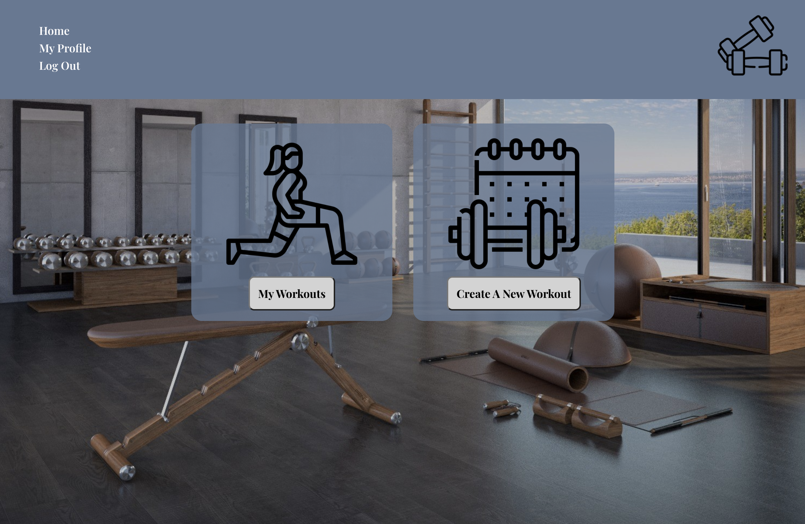
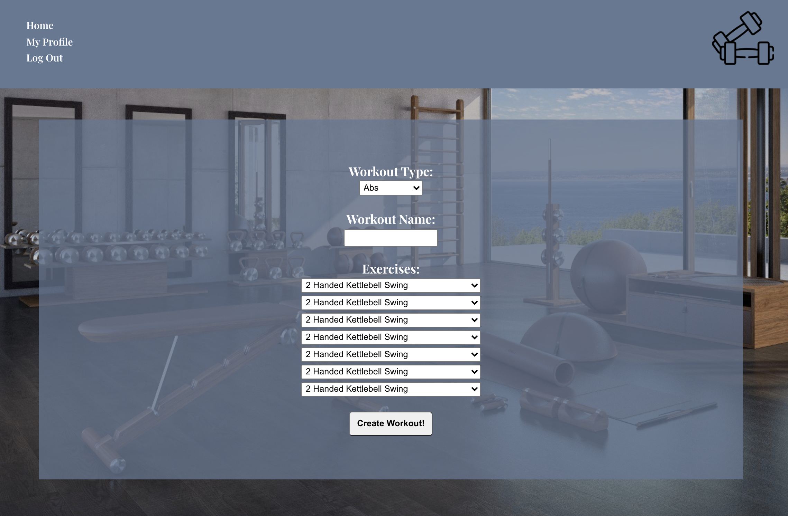
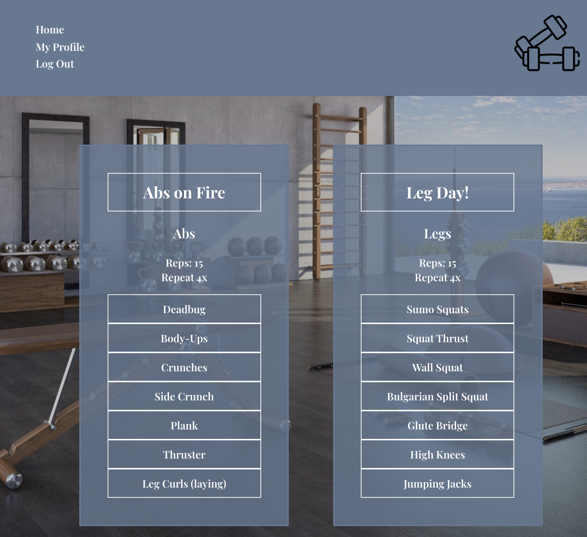
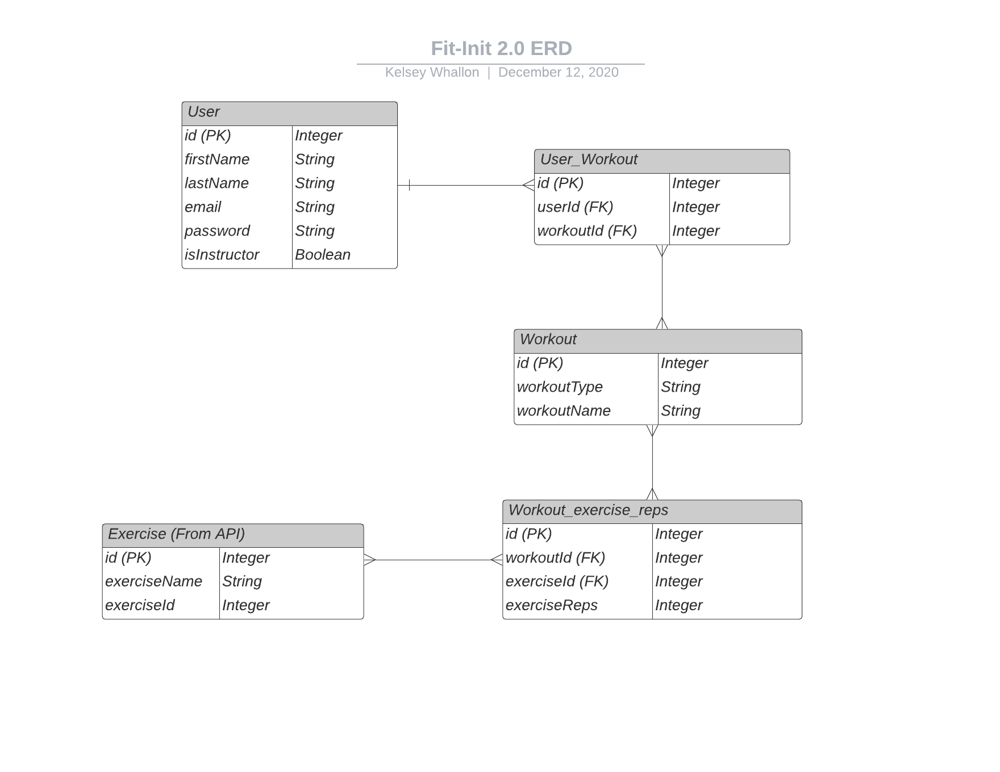
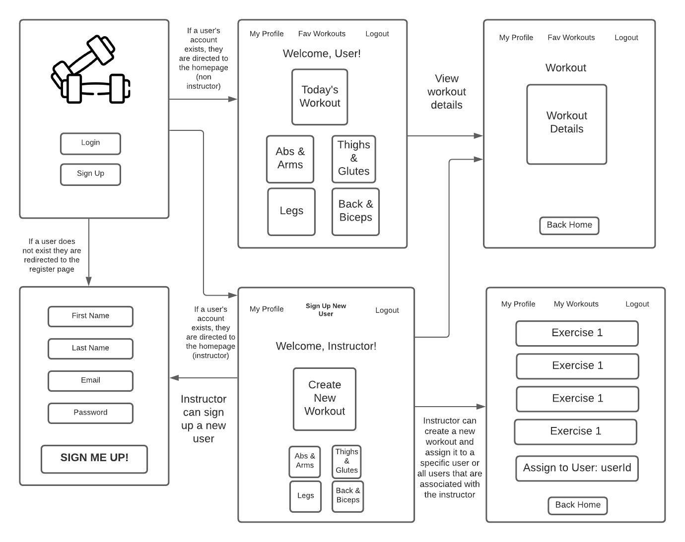

# Fit Init 2.0

I was inspired to create this app to help fitness instructors create workout plans for their clients using the [wger Workout Manager API](https://wger.de/en/software/api). As a fitness instructor myself, I wanted to build a tool that I could use with my own clients especially during the era of covid when in person training is not always an option.

Backend is located here:(https://github.com/kelseywhallon/fit-init-2.0-backend)

## How It Works

Once logged in, you will be able to create a new workout with a custom workout type, workout name, and exercises. After creating a new entry, the workout with my available to view on the "My Workouts" page. 

### Technologies Used
The front end is done completely with React.js.
- React hooks (useState, useEffect)
- SCSS Modules
- React Bootstrap
- Fetch API to handle all external APIs, including calls to the backend and The wger Workout Manager API.

The backend uses Express.js on the Node.js runtime. The database is PostgreSQL, using Sequelize as the ORM.
- Many-to-many exercises-workout relationship to create new workouts
- Sequelize seeder to facilitate actual loading of data 
- `passport` & `bcrypt` Node modules for secure authentication

## React Component Heirarchy 

- App 
    - Header
    - Routes 
        - Login 
            - Form 
        - Register 
            - Form 
        - Home 
        - Workouts 
            - Workout Details 
        - Create New Workout 
            - Form 
        - User Profile
            - Form 
        
## Project Planning

I used [this Trello board](https://trello.com/b/YrxQNpLE/fit-init-20) to manage project planning and task completion.

### Entity Relationship Diagram 

### Wireframes

## User Stories
- As a user, I want to be able to sign up or sign into an existing account from the website landing page.
- If a user already has an existing account, the user will want to be directed to the workouts homepage.
- As a user, I want to be able to log out of my account
- As a user, I want to be able to delete my account
- As a user on the homepage, I want to be able to select the workout of the day or have the option to view a workout from the archives based on workout category.
- As an instructor (admin), I want to be able to create a new workout
- As a user, I want to be able to select a workout and view the workout details
- As a user, I want to be able to "complete" the workout or add the workout to "favorites"

## Code Snippets 
[Many exercises to many workout associations](https://github.com/kelseywhallon/fit-init-2.0-backend/blob/263f8aba9c1805cd05193c7793f6a3437f7cb00f/controllers/workouts.js#L4-L29)

## Running Locally
The hosted version of this app can be found at: (not hosted yet, still needs to be deployed)

But if you'd like to play with the code your self, please do the following:

1. Local database is create, and is set up with the models provided with this repository, and config is changed to point to your local database.
2. `cd fit-init-2.0-frontend` 2. `cd fit-init-2.0-backend` 3. Create a config.json: -
3. sequelize db:migrate
4. Seed the database with Sequelize:
`cd fit-init-2.0-backend`
sequelize db:seed --seed seeders/20201209195317-users.js
5. Dependencies are install (npm i, both frontend and backend directories)

## Future Development
- Adding functionality to allow instructors to assign workouts to specific clients/ users. 
- Adding a dashboard for instructors to be able to view all users that are assigned to them. 
- Load more option as the DB or workouts continues to grow for clients
- Allow users to favorite specific workouts 
- Creating my own workout API

### Credits 
 - Icons made by <a href="http://www.freepik.com/" title="Freepik">Freepik</a> from <a href="https://www.flaticon.com/" title="Flaticon">www.flaticon.com</a>
 - EVERYONE IN SEIR 921!
 - Brock Whitbread-Cole
 - Michael Petty
 - James Sinkler
 - Tess Bishop
 - Lauren Nguyen
 - Derek Foster
 - Ashley Nguyen
 - Brock Molmen
 - Jane Cho
 - Casey Jenkins
 - Jamie Cabrigas
 - Lucy Franco
 
